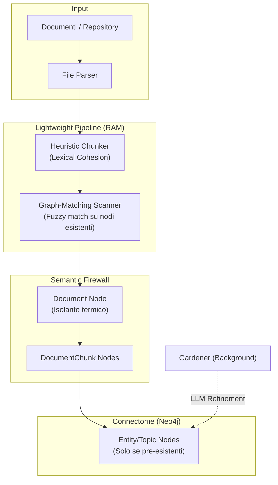

# Fase 9: Ingestione Documentale — Design & Decision Log

Questo documento consolida le specifiche tecniche e il registro delle decisioni per l'implementazione della Fase 9 (Massive Ingestion & Semantic Chunking).

---

## 1. Visione e Pivot Strategico

In fase di progettazione (16 Febbraio 2026), abbiamo effettuato un cambio di rotta fondamentale: siamo passati da un'architettura dipendente dagli LLM (VRAM-centric) a una **architettura Graph-First (RAM-centric)**.

### Perché il Pivot?

- **Efficienza**: L'ingestione massiva via LLM è troppo lenta (~100 pagine = centinaia di chiamate).
- **Indipendenza**: Mnemosyne deve funzionare fluidamente su hardware locale (Ollama) senza saturare la GPU.
- **Topologia**: Il grafo deve proteggere The Butler dal "rumore" dei documenti di archivio tramite la sua struttura, non tramite filtri software.

---

## 2. Architettura Proposta

---

## 3. Pilastri Tecnologici

### A. Heuristic Chunker (Zero LLM)

Utilizza la **Coesione Lessicale**:

- **Meccanismo**: Identifica i punti di rottura basandosi su headers strutturali e cambiamenti bruschi nel vocabolario tra paragrafi.
- **Vantaggio**: Esecuzione istantanea in Python, ideale per grandi repository.

### B. Graph-Matching Scanner

Invece di chiedere all'AI "che entità ci sono?", interroghiamo il Connectome:

- **Meccanismo**: Effettua un fuzzy matching del testo contro la lista (cacheata) dei nomi e alias dei nodi già nel grafo.
- **Vantaggio**: Risparmio totale di chiamate LLM. Valorizza la conoscenza che Mnemosyne ha già appreso dall'utente.

### C. Il "Semantic Firewall"

Architettura per prevenire l'inquinamento semantico (Super-nodi):

- I `DocumentChunk` non sono collegati direttamente a tutto il grafo con forza alta.
- Ogni chunk punta al suo nodo **`Document`** master.
- Il nodo `Document` agisce come isolante: l'attivazione cala drasticamente quando attraversa il confine del documento, a meno che l'utente non lo stia interrogando.

---

## 4. Registro delle Decisioni (Decision Log)

| Scelta | Decisione | Ragione |
|---|---|---|
| **Chunking** | Euristico vs LLM | Velocità e minor carico GPU. |
| **Estrazione** | Graph-matching vs LLM | Coerenza semantica e risparmio token/cicli. |
| **Gestione Heat** | Topologica (Firewall) vs Algoritmica | Minor latenza nelle query Neo4j. |
| **Workflow** | Background Worker | The Butler deve restare reattivo in chat durante l'upload. |

---

## 5. Impatto sui Moduli Esistenti

- **`perception.py`**: Aggiunta di `fast_scanner()` per il matching deterministico.
- **`graph_manager.py`**: Nuove relazioni `CONTAINS`, `NEXT_CHUNK` e isolamento per `Document`.
- **`llm.py`**: Ruolo limitato alla disambiguazione asincrona (tramite Gardener).

---

> [!NOTE]
> Questa documentazione serve come base per la futura implementazione del cantiere "Ingestione Documentale".
